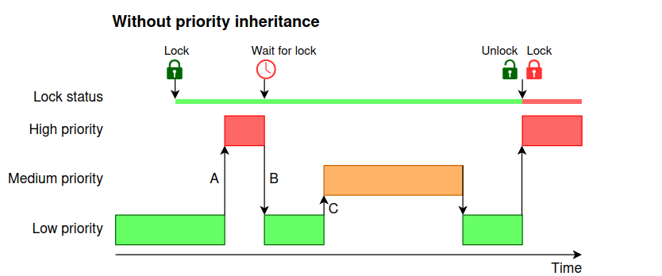
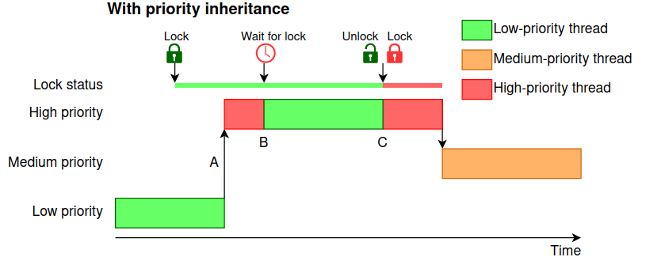

# 🚦 Priority Inversion 

## 🧠 What is Priority Inversion?

**Priority Inversion** is a concurrency problem where a **low-priority thread holds a resource** (e.g. a mutex) that a **high-priority thread needs**, but the high-priority thread ends up waiting because the **low-priority thread is not getting CPU time** (preempted by medium-priority threads). This leads to performance bottlenecks or even deadlocks in real-time systems.

This effectively **inverts** the assigned priorities of the tasks. This violates the **priority model** that high-priority tasks can only be prevented from running by higher-priority tasks. Inversion occurs when there is a resource contention with a low-priority task that is then preempted by a **medium-priority** task.

### Formulation
Consider two tasks H and L, of high and low priority respectively, either of which can acquire exclusive use of a shared resource R. If H attempts to acquire R after L has acquired it, then H becomes blocked until L relinquishes the resource. Sharing an exclusive-use resource (R in this case) in a well-designed system typically involves L relinquishing R promptly so that H (a higher-priority task) does not stay blocked for excessive periods of time. Despite good design, however, it is possible that a third task M of medium priority becomes runnable during L's use of R. At this point, M being higher in priority than L, preempts L (since M does not depend on R), causing L to not be able to relinquish R promptly, in turn causing H—the highest-priority process—to be unable to run (that is, H suffers unexpected blockage indirectly caused by lower-priority tasks like M).



## 💡 Key Concepts

* High-priority thread is blocked by a low-priority thread.
* Medium-priority threads (which don’t need the mutex) **can starve the low-priority thread**, prolonging the blocking.
* Real-time operating systems use **priority inheritance** to resolve this.

---

## 🧪 Code Example 

```cpp
#include <iostream>
#include <thread>
#include <mutex>
#include <chrono>

std::mutex mutex;

void lowPriorityThread() {
    std::cout << "[Low] Trying to lock mutex...\n";
    mutex.lock();
    std::cout << "[Low] Mutex locked. Working...\n";
    std::this_thread::sleep_for(std::chrono::seconds(5)); // simulate long work
    std::cout << "[Low] Work done. Releasing mutex.\n";
    mutex.unlock();
}

void mediumPriorityThread() {
    std::cout << "[Medium] Doing unrelated work...\n";
    for (int i = 0; i < 5; ++i) {
        std::cout << "[Medium] Working...\n";
        std::this_thread::sleep_for(std::chrono::seconds(1));
    }
    std::cout << "[Medium] Finished work.\n";
}

void highPriorityThread() {
    std::this_thread::sleep_for(std::chrono::milliseconds(100)); // wait for low to acquire lock
    std::cout << "[High] Trying to lock mutex...\n";
    std::lock_guard<std::mutex> lock(mutex);
    std::cout << "[High] Acquired mutex. Working...\n";
}

int main() {
    std::thread low(lowPriorityThread);
    std::thread medium(mediumPriorityThread);
    std::thread high(highPriorityThread);

    low.join();
    medium.join();
    high.join();
    return 0;
}
```

### 🔍 Output Behavior (Simulated)

Expected order:

```
[Low] Trying to lock mutex...
[Low] Mutex locked. Working...
[Medium] Doing unrelated work...
[Medium] Working...
[High] Trying to lock mutex...
```

The **High-priority thread is blocked**, but **Medium-priority thread runs**, preventing **Low** from releasing the mutex. This is **priority inversion**.


## 🛠️ Solution in Real-Time Systems

Real-time systems may implement **priority inheritance**, where:

* The low-priority thread **temporarily inherits** the higher priority.
* Prevents medium-priority threads from preempting.

> ⚠️ Standard C++ does **not** offer priority control or inheritance.
> To explore this fully, use:

* **RTOS** (like FreeRTOS, QNX)
* **POSIX with thread priorities**
* **`pthread_mutexattr_setprotocol()`** with `PTHREAD_PRIO_INHERIT` on Linux (via `pthread`)





       |


## 🎯 Priority Inversion in POSIX Threads (with Priority Inheritance)

### 📦 Prerequisites

Make sure you're on **Linux** and compile with `-pthread`:

```bash
g++ priority_inheritance.cpp -o priority_inheritance -lpthread
sudo ./priority_inheritance
```

You'll need **`sudo`** to set real-time priorities.

---

### Example

```cpp
#include <iostream>
#include <pthread.h>
#include <unistd.h>
#include <sched.h>

pthread_mutex_t mutex;

void* low_priority_task(void*) {
    std::cout << "[Low] Trying to acquire mutex...\n";
    pthread_mutex_lock(&mutex);
    std::cout << "[Low] Acquired mutex. Working...\n";
    sleep(5); // Simulate long work
    std::cout << "[Low] Releasing mutex.\n";
    pthread_mutex_unlock(&mutex);
    return nullptr;
}

void* medium_priority_task(void*) {
    std::cout << "[Medium] Working...\n";
    for (int i = 0; i < 5; ++i) {
        std::cout << "[Medium] Working...\n";
        sleep(1);
    }
    return nullptr;
}

void* high_priority_task(void*) {
    sleep(1); // Ensure low thread locks mutex first
    std::cout << "[High] Trying to acquire mutex...\n";
    pthread_mutex_lock(&mutex);
    std::cout << "[High] Acquired mutex. Doing quick work...\n";
    pthread_mutex_unlock(&mutex);
    return nullptr;
}

void set_thread_priority(pthread_t thread, int policy, int priority) {
    sched_param param;
    param.sched_priority = priority;
    if (pthread_setschedparam(thread, policy, &param) != 0) {
        perror("Failed to set thread priority");
    }
}

int main() {
    // Initialize mutex with priority inheritance
    pthread_mutexattr_t attr;
    pthread_mutexattr_init(&attr);
    pthread_mutexattr_setprotocol(&attr, PTHREAD_PRIO_INHERIT);
    pthread_mutex_init(&mutex, &attr);

    pthread_t low, medium, high;

    pthread_create(&low, nullptr, low_priority_task, nullptr);
    pthread_create(&medium, nullptr, medium_priority_task, nullptr);
    pthread_create(&high, nullptr, high_priority_task, nullptr);

    // Set scheduling policy and priorities (requires sudo)
    set_thread_priority(low, SCHED_FIFO, 10);     // Low
    set_thread_priority(medium, SCHED_FIFO, 20);  // Medium
    set_thread_priority(high, SCHED_FIFO, 30);    // High

    pthread_join(low, nullptr);
    pthread_join(medium, nullptr);
    pthread_join(high, nullptr);

    pthread_mutex_destroy(&mutex);
    pthread_mutexattr_destroy(&attr);

    return 0;
}
```

## 🔍 What Happens?

1. **Low** locks the mutex.
2. **High** tries to acquire it and blocks.
3. **Without inheritance**: **Medium** preempts **Low**, delaying **High**.
4. **With `PTHREAD_PRIO_INHERIT`**: **Low inherits High’s priority** → **Medium is blocked**, allowing Low to finish and release the mutex quickly.


## 🧾 Summary

| Concept                         | Description                                           |
| ------------------------------- | ----------------------------------------------------- |
| Priority Inversion | Low-priority thread blocks high-priority due to resource contention   |
| Cause              | Medium-priority threads preempt low-priority while it holds the mutex |
| Solution           | Use priority inheritance (in RTOS or custom scheduling logic)  
| `pthread_mutexattr_setprotocol` | Enables priority inheritance (`PTHREAD_PRIO_INHERIT`) |
| `SCHED_FIFO`                    | Real-time scheduling policy (must use `sudo`)         |
| `pthread_setschedparam`         | Assigns thread priority                               |

## OS Scheduler Considerations

Despite setting `SCHED_FIFO` and priorities **The system still may run the threads in unpredictable order** because:

🚨 Even with `sudo`, Linux may **not respect `SCHED_FIFO` priorities unless you set proper ulimits** or configure `/etc/security/limits.conf`.

## 🛠 How to Fix It

```bash
ulimit -r # check max real-time priority
ulimit -r unlimited  # or a large value, if not already

# OR edit:
sudo nano /etc/security/limits.conf

# Add lines:
*       -       rtprio 99
```

Also make sure your system is not limiting real-time tasks in `/etc/systemd` (`LimitRTPRIO=99`).

### ✅ Takeaway

* If the high-priority thread **waits on a mutex** and it’s being delayed by unrelated threads — that's **priority inversion**.
* **Priority inheritance prevents this** by **boosting the thread that holds the resource** temporarily.

