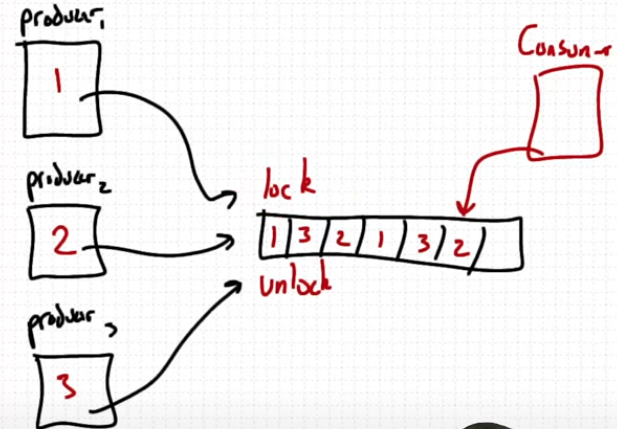

# `try_lock`

In multithreaded programming, locks prevent data races by ensuring only one thread accesses a critical section at a time. But what if a thread doesn’t want to wait for the lock and prefers to skip or try later?

That’s where **`try_lock`** comes in.

---

## 🚦 What is `try_lock`?

* `try_lock()` attempts to acquire the lock **without blocking**.
* It returns **immediately**:

  * `true` if the lock was acquired.
  * `false` if the lock is already held by another thread.
* Useful when threads can **continue doing other work** instead of waiting.


## 💡 Analogy

- Imagine an ATM.
- `lock()` = wait in line until it's your turn.
- `try_lock()` = if someone is using it, you leave and come back later.

---

## 🧪 Code Example: `try_lock` in Action

```cpp
#include <iostream>
#include <chrono>
#include <thread>
#include <mutex>

std::mutex g_lock;

void job1(){
    g_lock.lock();
    std::cout << "job1 is executed\n";
    g_lock.unlock();
}

void job2(){
    if(g_lock.try_lock()){
        std::cout << "job2 is executed\n";
        g_lock.unlock();
    } else {
        using namespace std::chrono_literals;
        std::this_thread::sleep_for(2s);
        if(g_lock.try_lock()){
            std::cout << "job2 executed on 2nd try\n";
            g_lock.unlock();
        }
    }
}

int main(){
    std::thread thread1(job1);
    std::thread thread2(job2);

    thread1.join();
    thread2.join();
    return 0;
}
```

## ▶️ Compile & Run

### Compile (Linux/macOS):

```bash
g++ -std=c++17 trylock.cpp -o trylock -lpthread && ./trylock && rm trylock
```

## 🧠 Output Behavior

* You may see:

  ```
  job1 is executed
  job2 executed on 2nd try
  ```

  or

  ```
  job2 is executed
  job1 is executed
  ```
* Behavior is **non-deterministic** due to thread scheduling.

---

## 🛠️ Where to Use `try_lock`

### 🔁 Producer/Consumer Model

* Threads (producers) try to add to a shared queue.
* If the queue is locked, they can:

  * Retry later
  * Sleep
  * Skip this cycle



### 🎮 Game AI or Simulation

* AI logic tries to lock game state.
* If it fails, skips and makes another decision — **avoids freezing** the game loop.

---

## ⚠️ Pitfalls

* **Forgetting to unlock** — leads to deadlocks.
* Use **RAII** with `std::lock_guard` or `std::unique_lock`:

---

## 🧰 `adopt_lock` with `lock_guard`

When you successfully `try_lock()` or `lock()` manually, you can pass ownership of the lock to a `lock_guard` using `std::adopt_lock`.

### Example:

```cpp
if(g_lock.try_lock()){
    std::lock_guard<std::mutex> guard(g_lock, std::adopt_lock);
    std::cout << "safe with RAII\n";
    // No need to manually unlock — RAII will handle it
}
```

* `std::adopt_lock` tells the `lock_guard` that the mutex is **already locked**, and it should **take over unlocking** when the guard goes out of scope.
* Prevents forgetting to call `unlock()` and keeps code cleaner.
* Use this carefully — only when you're sure the lock is already acquired.

---

## ✅ Summary

| Feature      | `lock()`                   | `try_lock()`                 |
| ------------ | -------------------------- | ---------------------------- |
| Behavior     | Waits until available      | Returns immediately          |
| Return value | None                       | `true` or `false`            |
| Use cases    | Critical must-run sections | Optional or retryable logic  |
| Risk         | Blocking threads           | Skipping execution if locked |

---

## 📌 Final Advice

* Use `try_lock` when **waiting isn't critical** or **you can retry later**.
* Always remember to **unlock**, or prefer **RAII** (`lock_guard`, `unique_lock`) with `adopt_lock`.
* Avoid deeply nested locking logic — it becomes hard to reason about and maintain.
* When in doubt, **design first**, then thread.
